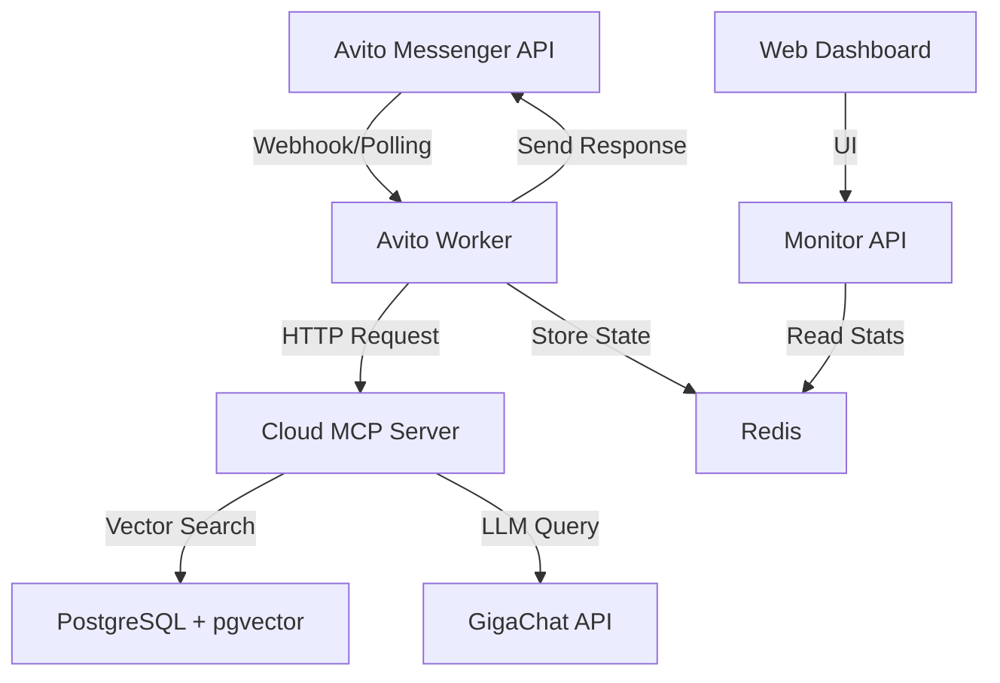

# AI Assistant for Avito Marketplace

ИИ-ассистент для автоматизации продаж на маркетплейсе Avito. Система интегрируется с Avito Messenger API, обрабатывает входящие сообщения клиентов и предоставляет персонализированные рекомендации товаров на основе RAG (Retrieval-Augmented Generation) технологии.

## 🎯 Ключевые возможности

### 🤖 **Автоматизация продаж**
- **Интеграция с Avito Messenger API** - автоматический опрос и обработка входящих сообщений
- **RAG-агент на GigaChat** - интеллектуальные ответы с поиском по базе товаров
- **Персонализированные рекомендации** - подбор товаров на основе запросов клиентов
- **Краткие ответы** - оптимизированные ответы до 400 токенов для быстрого общения

### 🏗️ **Модульная архитектура**
- **Avito Worker** - фоновый процесс для обработки сообщений
- **Cloud MCP Server** - RAG API с векторным поиском по товарам
- **Monitor API** - веб-интерфейс для мониторинга и статистики
- **Redis** - управление состоянием диалогов и кэширование

### 📊 **Мониторинг и аналитика**
- **Real-time статистика** - количество обработанных сообщений, активные диалоги
- **Web Dashboard** - визуальный интерфейс для отслеживания работы системы
- **Graceful shutdown** - корректное завершение работы без потери данных
- **Логирование** - детальные логи всех операций

## 🏛️ Архитектура системы



### Компоненты системы

1. **Avito Worker** (`src/avito_worker/`)
   - Опрос Avito API каждые 30 секунд
   - Обработка только последних непрочитанных сообщений
   - Интеграция с RAG-агентом через MCP
   - Автоматическая отправка ответов клиентам

2. **Cloud MCP Server** (`cloud_mcp/`)
   - RAG API с векторным поиском
   - Интеграция с Evolution AI Knowledge Base
   - Поиск релевантных товаров по запросам
   - FastMCP для совместимости с MCP протоколом

3. **Monitor API** (`src/monitor_api/`)
   - FastAPI для мониторинга системы
   - Web Dashboard с real-time статистикой
   - REST API для получения метрик
   - Health checks и диагностика

4. **Redis** - управление состоянием
   - Хранение состояния диалогов (TTL 24 часа)
   - Статистика работы системы
   - Кэширование результатов поиска

## 📁 Структура проекта

```
AV_ASSISTANT/
├── agent/                     # RAG-агент на GigaChat
│   ├── app/                   # Основной код агента
│   ├── gigachat/              # GigaChat интеграция
│   └── requirements.txt
├── cloud_mcp/                 # Cloud MCP Server (RAG API)
│   ├── cloud_server.py        # FastMCP сервер
│   └── requirements.txt
├── src/                       # Avito интеграция
│   ├── avito_worker/          # Worker для Avito API
│   ├── common/                # Общие модули
│   ├── monitor_api/           # Monitor API
│   └── docker-compose.yml     # Docker конфигурация
├── database/                  # База данных товаров
│   ├── create_db.py           # Создание векторной БД
│   └── shop_data_main.json    # Данные товаров
├── frontend/                  # Gradio веб-интерфейс
├── mcp_server/                # Локальный MCP сервер
├── config.py                  # Конфигурация проекта
├── docker-compose.yml         # Основная Docker конфигурация
└── README.md
```

## 🚀 Быстрый старт

### 1. Клонирование и настройка

```bash
git clone https://github.com/Filichkin/AV_ASSISTANT.git
cd AV_ASSISTANT
```

### 2. Настройка переменных окружения

Создайте файл `.env` в корне проекта:

```bash
# Avito API Configuration
AVITO_CLIENT_ID=your_client_id
AVITO_CLIENT_SECRET=your_client_secret
AVITO_USER_ID=your_user_id
AVITO_POLL_INTERVAL=30

# GigaChat Configuration
GIGACHAT_CREDENTIALS=your_credentials
GIGACHAT_SCOPE=GIGACHAT_API_PERS
GIGACHAT_MODEL=GigaChat:latest
GIGACHAT_TEMPERATURE=0.7
MAX_TOKENS=400

# Evolution AI (для Cloud MCP)
KEY_ID=your_key_id
KEY_SECRET=your_key_secret
EVOLUTION_PROJECT_ID=your_project_id
KNOWLEDGE_BASE_ID=your_kb_id
KNOWLEDGE_BASE_VERSION_ID=your_version_id

# Database Configuration
POSTGRES_HOST=localhost
POSTGRES_PORT=5432
POSTGRES_USER=postgres
POSTGRES_PASSWORD=12345
POSTGRES_DB=av_assistant

# Redis Configuration
REDIS_URL=redis://localhost:6379/0

# Monitor API
MONITOR_API_PORT=8080
```

### 3. Запуск через Docker Compose

```bash
# Сборка и запуск всех сервисов
docker-compose up -d

# Проверка статуса
docker-compose ps
```

### 4. Проверка работы

Откройте в браузере:
- **Monitor Dashboard**: http://localhost:8080/dashboard
- **Monitor API**: http://localhost:8080/docs
- **Health Check**: http://localhost:8080/health

## 🛠️ Локальная разработка

### Установка зависимостей

```bash
# Основные зависимости
pip install -r requirements.txt

# Зависимости для агента
pip install -r agent/requirements.txt

# Зависимости для Cloud MCP
pip install -r cloud_mcp/requirements.txt

# Зависимости для Avito Worker
pip install -r src/requirements.txt
```

### Запуск компонентов

```bash
# 1. Запуск Redis
redis-server

# 2. Запуск PostgreSQL с pgvector
docker run -d --name pgvector -e POSTGRES_PASSWORD=12345 -p 5432:5432 pgvector/pgvector:pg16

# 3. Создание векторной базы данных
python -m database.create_db

# 4. Запуск Cloud MCP Server
python -m cloud_mcp

# 5. Запуск Avito Worker
python -m src.avito_worker

# 6. Запуск Monitor API
python -m src.monitor_api

# 7. Запуск Gradio интерфейса (опционально)
python -m frontend.chat
```

## 📊 Мониторинг и статистика

### Monitor API Endpoints

- `GET /` - Информация о сервисе
- `GET /health` - Проверка здоровья системы
- `GET /stats` - Статистика работы worker
- `GET /dialogs` - Активные диалоги
- `GET /dashboard` - Web-интерфейс с дашбордом

### Пример статистики

```json
{
  "total_messages": 150,
  "completed_messages": 140,
  "failed_messages": 3,
  "active_dialogs": 12,
  "last_poll_time": "2025-10-26T21:20:00",
  "last_error": null
}
```

## ⚙️ Конфигурация

### Основные параметры

| Параметр | Описание | По умолчанию |
|----------|----------|--------------|
| `AVITO_POLL_INTERVAL` | Интервал опроса Avito API (сек) | 30 |
| `MAX_TOKENS` | Максимальная длина ответа агента | 400 |
| `GIGACHAT_TEMPERATURE` | Температура генерации (0.0-1.0) | 0.7 |
| `MONITOR_API_PORT` | Порт Monitor API | 8080 |

### Настройка базы данных

```bash
# Создание векторной базы данных
python -m database.create_db

# Принудительное пересоздание
FORCE_LOAD=1 python -m database.create_db
```

## 🔧 Troubleshooting

### Частые проблемы

**Worker не получает сообщения:**
1. Проверьте credentials Avito API в `.env`
2. Проверьте логи: `docker-compose logs -f avito-worker`
3. Убедитесь что `AVITO_USER_ID` корректный

**MCP Server недоступен:**
1. Проверьте credentials Evolution AI
2. Проверьте health check: `curl http://localhost:8003/`
3. Проверьте логи: `docker-compose logs -f cloud-mcp`

**Статистика показывает нули:**
1. Дождитесь первого цикла опроса (30 сек)
2. Проверьте подключение к Redis
3. Убедитесь что worker запущен

### Просмотр логов

```bash
# Все сервисы
docker-compose logs -f

# Конкретный сервис
docker-compose logs -f avito-worker
docker-compose logs -f cloud-mcp
docker-compose logs -f monitor-api
```

## 🚀 Масштабирование

### Горизонтальное масштабирование

```bash
# Запуск нескольких worker'ов
docker-compose up -d --scale avito-worker=3
```

### Оптимизация производительности

1. **Увеличение интервала опроса** для снижения нагрузки на API
2. **Настройка Redis** для кэширования результатов поиска
3. **Мониторинг ресурсов** через Monitor Dashboard

## 📈 Roadmap

- [ ] Поддержка других маркетплейсов (Wildberries, Ozon)
- [ ] Интеграция с CRM системами
- [ ] A/B тестирование ответов агента
- [ ] Аналитика эффективности продаж
- [ ] Многоязычная поддержка

## 🤝 Вклад в проект

1. Fork репозитория
2. Создайте feature branch (`git checkout -b feature/amazing-feature`)
3. Commit изменения (`git commit -m 'Add amazing feature'`)
4. Push в branch (`git push origin feature/amazing-feature`)
5. Создайте Pull Request

## 📄 Лицензия

Этот проект распространяется под лицензией MIT. См. файл `LICENSE` для подробностей.

## 🔗 Полезные ссылки

- [Avito Messenger API Documentation](https://developers.avito.ru/api-catalog/messenger-api)
- [GigaChat API Documentation](https://developers.sber.ru/portal/products/gigachat)
- [Model Context Protocol](https://modelcontextprotocol.io/)
- [FastMCP Documentation](https://github.com/jlowin/fastmcp)
- [pgvector Documentation](https://github.com/pgvector/pgvector)

---

⭐ **Понравился проект? Поставьте звездочку!** ⭐